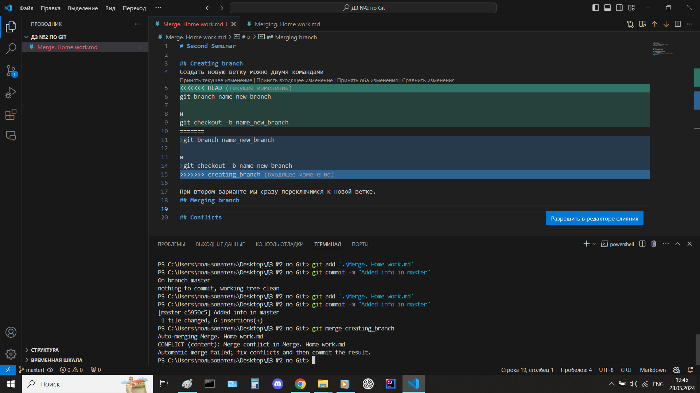

# Second Seminar

## Creating branch
Создать новую ветку можно двумя командами
>git branch name_new_branch

и
>git checkout -b name_new_branch

При втором варианте мы сразу переключимся к новой ветке.
## Merging branch
Слияние веток осуществляется командой
> git merge merging_branch_name

Перед вводом этой команды нужно переключиться на ветку, в которую планируется сливаение ветки merge_branch_name.
## Conflicts

Конфликты возникают, когда затрагивается общее рабочее пространство.

## Merger results
Результаты слияния могут быть следующие:
1. При слиянии веток может случиться конфликт слияния. Обусловлено это затрагиванием общего рабочего пространства.
2. При безконфликтном слиянии веток возможно 2 исхода:
    
    1. Слияние по стратегии **fast-forward**. 
    
        fast-forward слияние происходит когда в ветке куда сливаются данные отсутствует что-либо в рабочем пространстве, т.е. отсутствует конфликт.
    2. Слияние по **ort** стратегии. 
        
        ort слияние происходит когда в обоих ветках имеются изменения не затрагивающие общие рабочие пространства.
